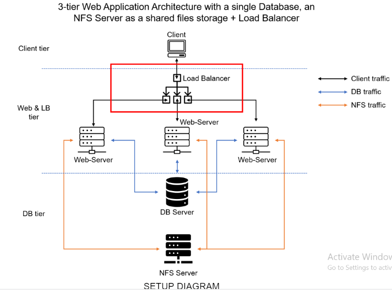
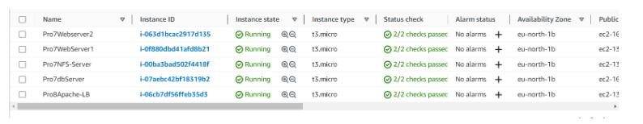

                            PROJECT 8 Latest
                    LOAD BALANCER SOLUTION WITH APACHE

                        

The concept in this project is to introduce a Load Balancer to distribute website traffic between the web servers and allow users to access the web site using a single URL.

Configure Apache As A Load Balancer
                          
Open TCP port 80 on Project-8-apache-lb by creating an Inbound Rule in Security Group.

